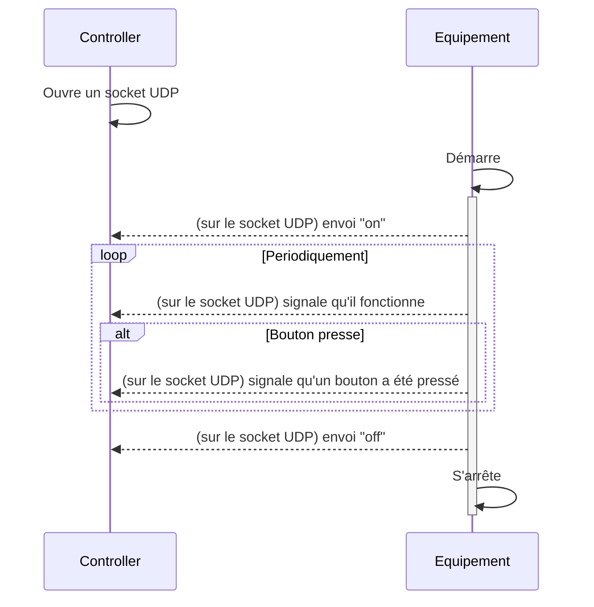
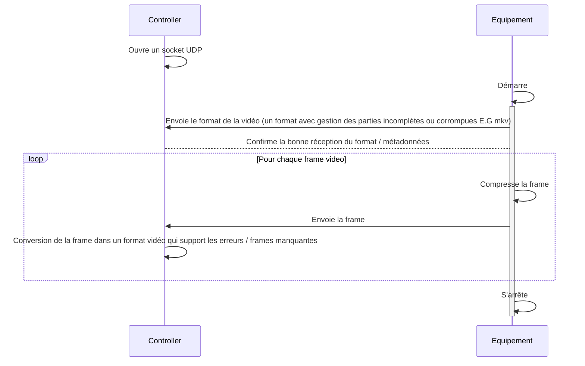
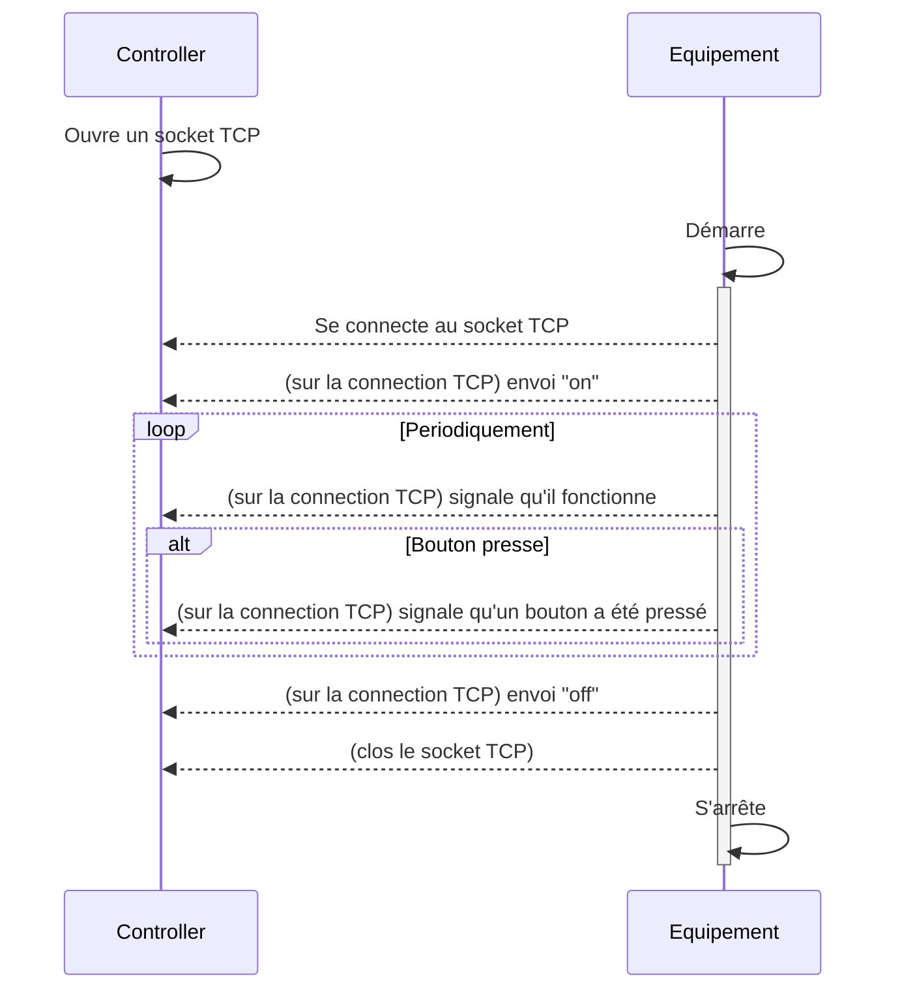
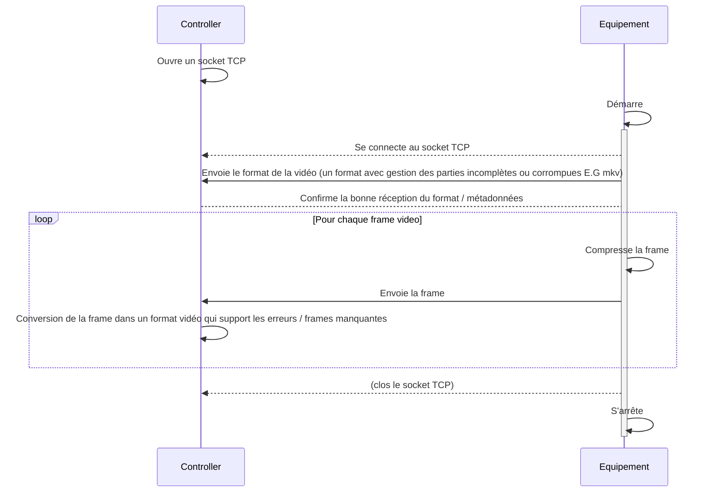

# 4IRC_ASIROS_PLANCHON_EX1
## UDP
### Controle & sporadique
L'exemple peut-être lancé avec les fichiers `udp_controller_simple.py` et `udp_equipment_simple.py` ou directement `start_simple.py`

### Flux
L'exemple peut-être lancé avec les fichiers `udp_controller_video.py` et `udp_equipment_video.py` ou directement `start_video.py`

Un format vidéo qui supporte les erreurs peut-être du mkv par exemple qui est robuste au erreurs et frames manquantes ou du mp4 en mode "Fast Start" (avec les metadonnées en premier). 

## TCP
### Controle & sporadique
L'exemple peut-être lancé avec les fichiers `tcp_controller_simple.py` et `tcp_equipment_simple.py` ou directement `start_simple.py`

### Flux
L'exemple peut-être lancé avec les fichiers `tcp_controller_video.py` et `tcp_equipment_video.py` ou directement `start_video.py`

## Avis
TCP devrait être utilisé pour les ressources critiques et ce qui ne devrait pas être loupé (les communications de contrôle qui ne sont pas périodiques par exemple) ou pour les évenements sporadiques. UDP devrait être plutôt utilisé pour les évenements sporadiques tel qu'un message "alive", ou pour la vidéo par exemple, une frame perdue ce n'est pas grave.