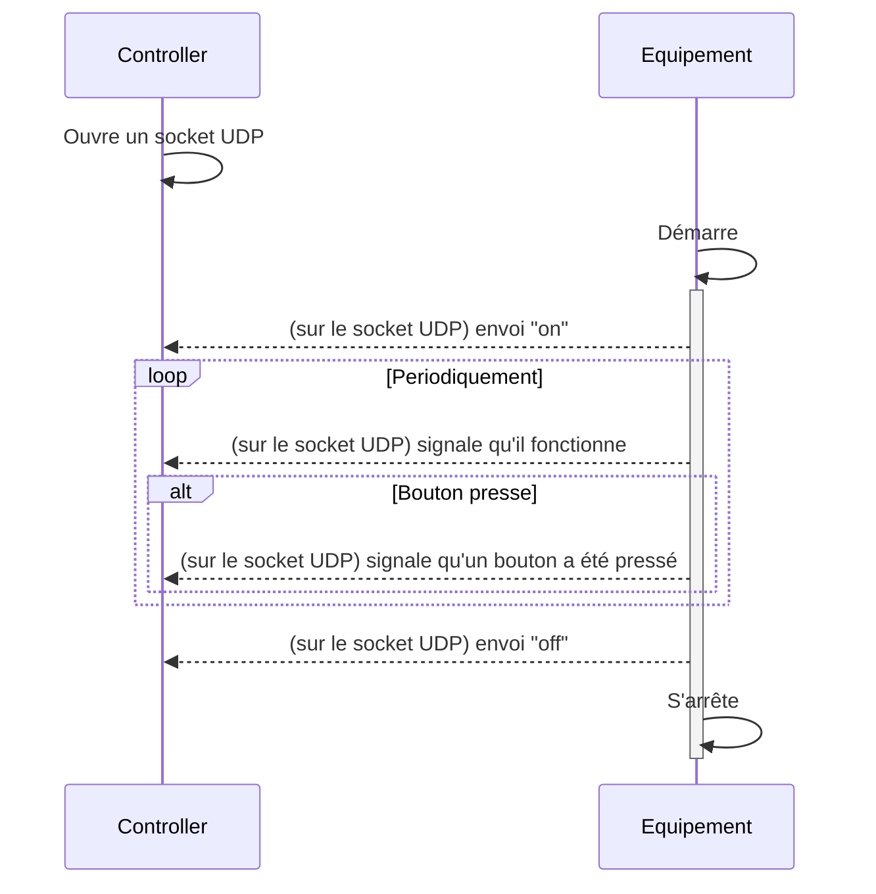
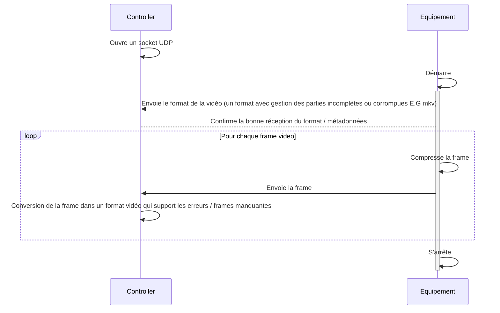

# 4IRC_ASIROS_PLANCHON_EX1
## UDP
### Controle & sporadique

### Flux

Un format vidéo qui supporte les erreurs peut-être du mkv par exemple qui est robuste au erreurs et frames manquantes ou du mp4 en mode "Fast Start" (avec les metadonnées en premier). 

## TCP

## Comparaison & avis
